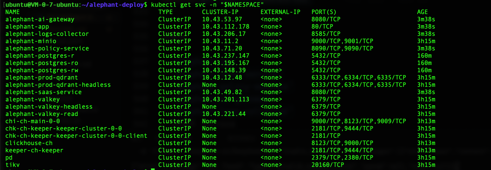

# Alephant K8s 用户部署操作手册

本文档用于指导用户在**已有 Kubernetes 集群**中部署 Alephant。内容按 GitHub 项目中的 `k8s/README.md` 和项目安装流程整理。

本文默认命名空间为：

```bash
alephant-prod
```

## 1. 部署目标

部署完成后，Kubernetes 集群中会包含：

| 类型 | 组件 |
|---|---|
| 前端 | `alephant-app` |
| 后端服务 | `alephant-saas-service` |
| 策略服务 | `alephant-policy-service` |
| AI 网关 | `alephant-ai-gateway` |
| 日志服务 | `alephant-logs-collector` |
| 基础设施 | PostgreSQL、ClickHouse、Valkey、Qdrant、MinIO、PD、TiKV |

业务服务通过 Kubernetes Service DNS 访问基础设施组件。

## 2. 前置要求

### 2.1 Kubernetes 集群要求

按项目 `k8s/README.md`：

| 组件 | 要求 | 是否必需 |
|---|---|---|
| Kubernetes 集群 | v1.25+ | 必需 |
| Helm | v3.12+ | 推荐 |
| Ingress Controller | HAProxy、Nginx、ALB、Traefik 等 | 可选 |
| cert-manager | v1.12+ | 可选，用于自动 TLS |
| ArgoCD | v2.8+ | 可选，用于 GitOps |

检查命令：

```bash
kubectl version
helm version
kubectl get nodes -o wide
kubectl get storageclass
```

### 2.2 用户需要准备的信息
license.jwt 和 镜像仓库账号密码 请联系alephant团队获取(dev@alephant.io)

| 信息 | 用途 |
|---|---|
| `kubectl` 集群访问权限 | 执行部署命令 |
| 镜像仓库账号密码 | 拉取 `registry.openmodels.link/alephant` 私有镜像 |
| `license.jwt` | Alephant 私有化授权 |
| 工作空间拥有者邮箱 | 设置 `PRIVATE_WORKSPACE_OWNER_EMAILS` |
| 域名和证书方案 | 配置 Ingress，对外访问 |
| 中间件密码/API Key | PostgreSQL、ClickHouse、Valkey、Qdrant、MinIO 等连接使用 |

### 2.3 k3s 单节点最小验证资源说明

当前仓库 `k8s/middlewares/` 默认按该场景调整：

- 使用 k3s 默认 StorageClass：`local-path`
- PostgreSQL、ClickHouse、ClickHouse Keeper、Qdrant、PD、TiKV、MinIO 均为单副本
- 中间件 PVC 申请量合计约 39Gi，需要预留镜像、日志和系统空间
- 该配置不提供高可用；生产环境需恢复多副本、独立数据盘和备份策略

### 2.4 集群部署配置说明

仓库保留两套 K8s 配置：

| 场景 | 业务配置 | 中间件配置 |
|---|---|---|
| 单节点验证 | `k8s/values.yaml` | `k8s/middlewares/*.values.yaml`、`minio.values.yaml`、`tikv-pd.yaml` |
| 集群部署 | `k8s/values.cluster.yaml` | `k8s/middlewares/*.cluster.values.yaml`、`minio.cluster.yaml`、`tikv-pd.cluster.yaml` |

集群配置按 README 路由模板启用 Ingress，并将业务服务副本数调整为 2。中间件配置调整为 PostgreSQL 3 实例、ClickHouse 2 副本 + Keeper 3 副本、Qdrant 3 副本、Valkey 1 主 2 从、MinIO 4 副本、PD 3 副本、TiKV 3 副本。

集群配置文件中的 `REPLACE_WITH_CLUSTER_STORAGE_CLASS` 必须在部署前替换为实际集群 StorageClass。生产或准生产环境不要使用 `local-path` 承载数据。

不要把集群配置直接叠加到已有单节点验证环境。部分资源的部署形态会变化，例如 MinIO 从 Deployment/PVC 切换为 StatefulSet/volumeClaimTemplates，PD/TiKV 从单副本切换为 3 副本。已有数据环境需要先制定迁移或重建方案；新集群建议使用全新 namespace 按集群配置部署。


## 3. 获取部署项目

```bash
# 若服务器无法访问github.com，可下载后上传至服务器
git clone https://github.com/hong3yang/alephant-deploy.git
cd alephant-deploy
```

后续命令默认在 `alephant-deploy` 项目根目录执行。

## 4. 创建命名空间

```bash
export NAMESPACE=alephant-prod

kubectl create namespace "$NAMESPACE" --dry-run=client -o yaml | kubectl apply -f -
```

检查：

```bash
kubectl get namespace "$NAMESPACE"
```

## 4.1 准备中间件凭据

部署中间件前先确定并记录以下值。后续中间件部署会通过 Secret 或 Helm `--set-string` 注入这些值，不要把真实密码/API Key 写入 `k8s/middlewares/*.yaml`。执行 `start-k8s.sh` 前也必须导出同一组环境变量。

```bash
export POSTGRES_PASSWORD="<replace-me>"
export CLICKHOUSE_PASSWORD="<replace-me>"
export VALKEY_PASSWORD="<replace-me>"
export QDRANT_API_KEY="<replace-me>"
export MINIO_ROOT_USER="minioadmin"
export MINIO_ROOT_PASSWORD="<replace-me>"
```

建议使用 `openssl rand -hex 16` 生成无引号、无空格的值。

## 5. 配置私有镜像仓库权限

Alephant 业务镜像位于：

```text
registry.openmodels.link/alephant
```

创建镜像拉取 Secret：
<镜像仓库用户名> 和 <镜像仓库密码> 通过jwt授权邮件提供，需重新获取，请联系alephant团队(dev@alephant.io)

```bash
kubectl create secret docker-registry openmodels-registry \
  --docker-server=registry.openmodels.link \
  --docker-username="<镜像仓库用户名>" \
  --docker-password="<镜像仓库密码>" \
  -n "$NAMESPACE" \
  --dry-run=client -o yaml | kubectl apply -f -
```

让默认 ServiceAccount 使用该 Secret：

```bash
kubectl patch serviceaccount default -n "$NAMESPACE" \
  -p '{"imagePullSecrets":[{"name":"openmodels-registry"}]}'
```

检查：

```bash
kubectl get secret openmodels-registry -n "$NAMESPACE"
kubectl get serviceaccount default -n "$NAMESPACE" -o yaml
```


## 6. 部署基础设施中间件

业务 Helm Chart 不负责创建中间件。请先按 README 部署以下组件。

本章默认命令使用单节点验证配置。如果是集群部署，请把命令中的配置文件替换为对应的 `*.cluster.*` 文件，并先替换 StorageClass 占位值：

```bash
grep -R "REPLACE_WITH_CLUSTER_STORAGE_CLASS" k8s/middlewares
```

### 6.1 添加 Helm 仓库

```bash
helm repo add weconomy https://helm-charts.weconomy.network
helm repo update
```

### 6.2 部署 PostgreSQL

README 使用内部 `cnpg-cluster` chart。

当前 `sql/pgsql.sql` 由 PostgreSQL 18.3 导出，`k8s/middlewares/postgres.values.yaml` 已固定使用 `ghcr.io/cloudnative-pg/postgresql:18.3`。

```bash
kubectl create secret generic alephant-postgres-app \
  --namespace "$NAMESPACE" \
  --from-literal=username=alephant \
  --from-literal=password="$POSTGRES_PASSWORD" \
  --dry-run=client -o yaml | kubectl apply -f -
```

单节点部署时使用：
```
helm upgrade --install alephant-postgres weconomy/cnpg-cluster \
  --version 0.1.0 \
  --namespace "$NAMESPACE" \
  --create-namespace \
  -f k8s/middlewares/postgres.values.yaml
```

集群部署时改用：

```bash
helm upgrade --install alephant-postgres weconomy/cnpg-cluster \
  --version 0.1.0 \
  --namespace "$NAMESPACE" \
  --create-namespace \
  -f k8s/middlewares/postgres.cluster.values.yaml
```

服务地址：

```text
alephant-postgres-rw.alephant-prod.svc.cluster.local:5432
```

数据库和用户：

```text
database: alephant
user: alephant
```

`k8s/middlewares/postgres.values.yaml` 已引用 `alephant-postgres-app`，请确认 Secret 中的 `password` 与 `POSTGRES_PASSWORD` 一致。

### 6.3 部署 ClickHouse

README 使用内部 `clickhouse-cluster` chart，基于 Altinity Operator。

部署前必须确认：

- 已导出 `CLICKHOUSE_PASSWORD`
- 单节点验证配置已按 k3s 默认 Pod CIDR/Service CIDR `10.42.0.0/16`、`10.43.0.0/16` 预置；集群配置部署前建议按实际 Pod CIDR 和 Service CIDR 收窄 `users.default/networks/ip`

先安装 Altinity ClickHouse Operator 和 CRD：

```bash
helm repo add altinity https://docs.altinity.com/clickhouse-operator/
helm repo update altinity

kubectl create namespace clickhouse --dry-run=client -o yaml | kubectl apply -f -

helm upgrade --install clickhouse-operator altinity/altinity-clickhouse-operator \
  --version 0.27.2 \
  --namespace clickhouse \
  --create-namespace
```

确认 CRD 已安装：

```bash
kubectl get crd | grep -E 'clickhouse.*altinity|clickhousekeeper'
```

至少应看到：

```text
clickhouseinstallations.clickhouse.altinity.com
clickhousekeeperinstallations.clickhouse-keeper.altinity.com
```

如果跳过这一步，部署 `weconomy/clickhouse-cluster` 时会报：

```text
no matches for kind "ClickHouseInstallation" in version "clickhouse.altinity.com/v1"
no matches for kind "ClickHouseKeeperInstallation" in version "clickhouse-keeper.altinity.com/v1"
ensure CRDs are installed first
```

设置 Operator 监听业务 namespace：

```bash
kubectl set env deployment/clickhouse-operator-altinity-clickhouse-operator \
  -n clickhouse WATCH_NAMESPACES=clickhouse,alephant-prod
kubectl rollout restart deployment/clickhouse-operator-altinity-clickhouse-operator -n clickhouse
kubectl rollout status deployment/clickhouse-operator-altinity-clickhouse-operator -n clickhouse --timeout=180s
```

当前 values 使用 `clickhouse-server:25.3` 和 `clickhouse-keeper:25.3-alpine`。

单节点部署时：

```bash
helm upgrade --install alephant-clickhouse weconomy/clickhouse-cluster \
  --version 0.1.1 \
  --namespace "$NAMESPACE" \
  --create-namespace \
  -f k8s/middlewares/clickhouse.values.yaml \
  --set-string users.default/password="$CLICKHOUSE_PASSWORD"
```

集群部署时改用：

```bash
helm upgrade --install alephant-clickhouse weconomy/clickhouse-cluster \
  --version 0.1.1 \
  --namespace "$NAMESPACE" \
  --create-namespace \
  -f k8s/middlewares/clickhouse.cluster.values.yaml \
  --set-string users.default/password="$CLICKHOUSE_PASSWORD"
```

服务地址：

```text
HTTP: clickhouse-ch.alephant-prod.svc.cluster.local:8123
TCP:  clickhouse-ch.alephant-prod.svc.cluster.local:9000
```

### 6.4 部署 Valkey

单节点部署时：
```bash
helm repo add valkey https://valkey.io/valkey-helm/
helm repo update

helm upgrade --install alephant-valkey valkey/valkey \
  --version 0.9.4 \
  --namespace "$NAMESPACE" \
  --create-namespace \
  -f k8s/middlewares/valkey.values.yaml \
  --set-string auth.aclUsers.default.password="$VALKEY_PASSWORD"
```

集群部署时改用：

```bash
helm repo add valkey https://valkey.io/valkey-helm/
helm repo update

helm upgrade --install alephant-valkey valkey/valkey \
  --version 0.9.4 \
  --namespace "$NAMESPACE" \
  --create-namespace \
  -f k8s/middlewares/valkey.cluster.values.yaml \
  --set-string auth.aclUsers.default.password="$VALKEY_PASSWORD"
```

服务地址：

```text
alephant-valkey.alephant-prod.svc.cluster.local:6379
```

### 6.5 部署 Qdrant

单节点部署时：
```bash
helm repo add qdrant https://qdrant.github.io/qdrant-helm/
helm repo update

helm upgrade --install alephant-prod-qdrant qdrant/qdrant \
  --version 1.17.1 \
  --namespace "$NAMESPACE" \
  --create-namespace \
  -f k8s/middlewares/qdrant.values.yaml \
  --set-string config.service.api_key="$QDRANT_API_KEY"
```

当前 values 已按单节点配置：`replicaCount: 1`，并关闭 `config.cluster.enabled`。

集群部署时改用：

```bash
helm repo add qdrant https://qdrant.github.io/qdrant-helm/
helm repo update

helm upgrade --install alephant-prod-qdrant qdrant/qdrant \
  --version 1.17.1 \
  --namespace "$NAMESPACE" \
  --create-namespace \
  -f k8s/middlewares/qdrant.cluster.values.yaml \
  --set-string config.service.api_key="$QDRANT_API_KEY"
```

服务地址：

```text
HTTP: alephant-prod-qdrant.alephant-prod.svc.cluster.local:6333
gRPC: alephant-prod-qdrant.alephant-prod.svc.cluster.local:6334
```

### 6.6 部署 MinIO

单节点部署时：
```bash
kubectl create secret generic alephant-minio-secret \
  --from-literal=MINIO_ROOT_USER="$MINIO_ROOT_USER" \
  --from-literal=MINIO_ROOT_PASSWORD="$MINIO_ROOT_PASSWORD" \
  -n "$NAMESPACE" \
  --dry-run=client -o yaml | kubectl apply -f -

kubectl apply -f k8s/middlewares/minio.values.yaml
```

集群部署时改用：

```bash
kubectl create secret generic alephant-minio-secret \
  --from-literal=MINIO_ROOT_USER="$MINIO_ROOT_USER" \
  --from-literal=MINIO_ROOT_PASSWORD="$MINIO_ROOT_PASSWORD" \
  -n "$NAMESPACE" \
  --dry-run=client -o yaml | kubectl apply -f -

kubectl apply -f k8s/middlewares/minio.cluster.yaml
```

部署前请确认已导出 `MINIO_ROOT_USER` 和 `MINIO_ROOT_PASSWORD`。MinIO 账号密码通过 `alephant-minio-secret` 注入，不要把真实密码写入 `k8s/middlewares/minio.values.yaml`。默认 `MINIO_ROOT_USER` 为 `minioadmin`。

注意：`pgsty/minio` 镜像不能用 `command` 覆盖 entrypoint，启动参数必须写在 `args` 中。当前 manifest 已按该方式配置。

服务地址：

```text
S3 API:  alephant-minio.alephant-prod.svc.cluster.local:9000
Console: alephant-minio.alephant-prod.svc.cluster.local:9001
```

### 6.7 部署 TiKV + PD

单节点部署时：
```bash
kubectl apply -f k8s/middlewares/tikv-pd.yaml
```

集群部署时改用：

```bash
kubectl apply -f k8s/middlewares/tikv-pd.cluster.yaml
```

服务地址：

```text
PD:   pd.alephant-prod.svc.cluster.local:2379
TiKV: tikv.alephant-prod.svc.cluster.local:20160
```

当前配置使用 k3s 默认 `local-path`，会把数据落在节点本地磁盘。生产环境请改为独立块存储或云盘 StorageClass。

### 6.8 验证中间件

```bash
kubectl get pods -n "$NAMESPACE" -o wide
kubectl get pvc -n "$NAMESPACE"
kubectl get svc -n "$NAMESPACE"
```

所有基础设施 Pod 必须先进入 `Running`，再继续部署业务服务。

## 7. 创建业务 Secret 和初始化数据库

项目 README 中说明业务服务依赖以下 Secret：

| Secret 名称 | 对应服务 |
|---|---|
| `alephant-saas-service-secrets` | SaaS 后端 |
| `alephant-policy-service-secrets` | 策略服务 |
| `alephant-ai-gateway-secrets` | AI 网关 |
| `alephant-logs-collector-secrets` | 日志收集器 |

项目安装脚本会校验中间件凭据、生成业务侧随机密钥、创建 Secret/ConfigMap，并初始化数据库。

执行前确认：

- 中间件已经全部 Running
- PostgreSQL、ClickHouse、Valkey、Qdrant、MinIO 等密码/API Key 与部署中间件时导出的环境变量一致
- 已准备工作空间拥有者邮箱；可以提前导出 `PRIVATE_WORKSPACE_OWNER_EMAILS`，也可以在脚本提示时输入

如果前面已经在当前 shell 中导出过这些变量，可以跳过本段。`export` 只在当前 shell 会话有效；如果是新终端或重新登录服务器，请重新导出：

```bash
export POSTGRES_PASSWORD="<same-as-alephant-postgres-app>"
export CLICKHOUSE_PASSWORD="<same-as-clickhouse-helm-set>"
export VALKEY_PASSWORD="<same-as-valkey-helm-set>"
export QDRANT_API_KEY="<same-as-qdrant-helm-set>"
export MINIO_ROOT_USER="minioadmin"
export MINIO_ROOT_PASSWORD="<same-as-alephant-minio-secret>"
```

执行脚本前可以用以下命令检查变量是否已设置；该命令不会打印真实密码：

```bash
for v in POSTGRES_PASSWORD CLICKHOUSE_PASSWORD VALKEY_PASSWORD QDRANT_API_KEY MINIO_ROOT_PASSWORD; do
  [ -n "${!v:-}" ] && echo "$v 已设置" || echo "$v 未设置"
done
```

如果当前项目版本提供 `start-k8s.sh`，执行：

```bash
bash start-k8s.sh
```

脚本会按以下规则处理交互：

- 如果未导出 `PRIVATE_WORKSPACE_OWNER_EMAILS`，会提示输入工作空间拥有者邮箱
- 如果 `license/license.jwt` 已存在，会询问是否覆盖；首次部署使用已准备好的 license 时直接选择默认 `N`
- 如果 `license/license.jwt` 不存在，会提示粘贴 License 内容
- namespace，默认 `alephant-prod`
- 是否开始创建 Secret、ConfigMap 和初始化数据库

注意：

- 初始化数据库会向 PostgreSQL 和 ClickHouse 写入表结构及初始化数据。
- 如果不是全新数据库，请先备份，并由专业人员确认后再执行。
- 生产环境应记录脚本输出的关键凭据和随机密钥，妥善保存。

验证 License ConfigMap：

```bash
kubectl get configmap alephant-license -n "$NAMESPACE"
```

验证 Secret：

```bash
kubectl get secret -n "$NAMESPACE" | grep alephant
```

验证 SQL ConfigMap：

```bash
kubectl get configmap -n "$NAMESPACE" | grep alephant
```

## 8. 部署 Alephant 业务服务

### 8.1 添加业务 Helm 仓库

```bash
helm repo add weconomy https://helm-charts.weconomy.network
helm repo update weconomy
```

### 8.2 执行 Helm 部署

部署前先确认前端运行时环境变量。前端代码运行在用户浏览器中，因此这里必须填写浏览器可访问的地址，不能填写 Kubernetes 集群内 Service DNS。

当前单节点 SSH tunnel / port-forward 验证建议使用：

```yaml
app:
  env:
    API_BASE_URL:
      value: "http://127.0.0.1:18080"
    GATEWAY_BASE_URL:
      value: "http://127.0.0.1:18081/v1"
    COLLECTOR_BASE_URL:
      value: "http://127.0.0.1:18082"
```

如果后续使用公网域名或 Ingress，请改成实际域名，例如：

```yaml
app:
  env:
    API_BASE_URL:
      value: "https://your-domain.com"
    GATEWAY_BASE_URL:
      value: "https://ai.your-domain.com/v1"
    COLLECTOR_BASE_URL:
      value: "https://analytics.your-domain.com"
```

单节点部署时：
```bash
helm upgrade --install alephant-prod weconomy/common \
  --version 0.1.16 \
  --namespace "$NAMESPACE" \
  --create-namespace \
  -f k8s/values.yaml
```

集群部署时使用：

```bash
helm upgrade --install alephant-prod weconomy/common \
  --version 0.1.16 \
  --namespace "$NAMESPACE" \
  --create-namespace \
  -f k8s/values.cluster.yaml
```

如果需要启用 Ingress，请先修改 `k8s/values.yaml` 中的 `ingress` 配置，再执行 Helm 命令。集群配置 `k8s/values.cluster.yaml` 已默认启用 Ingress，并沿用 README 中的 `openmodels.link`、`ai.openmodels.link`、`analytics.openmodels.link` 路由模板；实际部署前请按现场域名调整。

### 8.3 等待业务服务启动

```bash
kubectl rollout status deployment/alephant-app -n "$NAMESPACE" --timeout=300s
kubectl rollout status deployment/alephant-saas-service -n "$NAMESPACE" --timeout=300s
kubectl rollout status deployment/alephant-policy-service -n "$NAMESPACE" --timeout=300s
kubectl rollout status deployment/alephant-ai-gateway -n "$NAMESPACE" --timeout=300s
kubectl rollout status deployment/alephant-logs-collector -n "$NAMESPACE" --timeout=300s
```

查看 Pod：

```bash
kubectl get pods -n "$NAMESPACE" -o wide
```

期望看到业务 Pod 都是 `1/1 Running`。

## 9. 配置 Ingress

如果只做内部验证，可以先跳过 Ingress，用 `kubectl port-forward` 访问。

如果需要正式对外访问，请在 `k8s/values.yaml` 中设置：

- `ingress.enabled: true`
- `ingress.className`
- 域名
- TLS Secret 或 cert-manager 注解

README 给出的路由参考：

| 域名 | 路径 | 后端服务 |
|---|---|---|
| `openmodels.link` | `/api/v1` | `alephant-saas-service:8080` |
| `openmodels.link` | `/` | `alephant-app:80` |
| `ai.openmodels.link` | `/v1` | `alephant-ai-gateway:8080` |
| `analytics.openmodels.link` | `/v1` | `alephant-logs-collector:8585` |

修改完成后更新部署：

```bash
helm upgrade alephant-prod weconomy/common \
  --version 0.1.16 \
  --namespace "$NAMESPACE" \
  -f k8s/values.yaml
```

## 10. 验证系统可用

### 10.1 查看 Service

```bash
kubectl get svc -n "$NAMESPACE"
```

应看到：

- `alephant-app`
- `alephant-saas-service`
- `alephant-policy-service`
- `alephant-ai-gateway`
- `alephant-logs-collector`
- 中间件 Service
  


### 10.2 验证 SaaS 健康接口

端口转发：

```bash
kubectl port-forward -n "$NAMESPACE" svc/alephant-saas-service 18080:8080
```

另开终端：

```bash
curl http://127.0.0.1:18080/health
```

期望返回：

```json
{
  "status": "ok",
  "services": {
    "database": "ok",
    "redis": "ok",
    "storage": "ok"
  }
}
```

### 10.3 验证前端

前端页面会调用 SaaS、Gateway 和 Collector，因此本地验证时建议同时转发 4 个服务：

如果 Kubernetes 部署在远程服务器上，先从本机建立 SSH tunnel：

```bash
ssh \
  -L 18000:127.0.0.1:18000 \
  -L 18080:127.0.0.1:18080 \
  -L 18081:127.0.0.1:18081 \
  -L 18082:127.0.0.1:18082 \
  ubuntu@<server-ip>
```

然后在 SSH 登录后的服务器终端执行：

```bash
pkill -f 'kubectl.*port-forward.*alephant' || true
ulimit -n 65535

nohup kubectl port-forward -n "$NAMESPACE" --address 127.0.0.1 svc/alephant-app 18000:80 >/tmp/alephant-app-pf.log 2>&1 &
nohup kubectl port-forward -n "$NAMESPACE" --address 127.0.0.1 svc/alephant-saas-service 18080:8080 >/tmp/alephant-saas-pf.log 2>&1 &
nohup kubectl port-forward -n "$NAMESPACE" --address 127.0.0.1 svc/alephant-ai-gateway 18081:8080 >/tmp/alephant-ai-gateway-pf.log 2>&1 &
nohup kubectl port-forward -n "$NAMESPACE" --address 127.0.0.1 svc/alephant-logs-collector 18082:8585 >/tmp/alephant-logs-collector-pf.log 2>&1 &
```

浏览器打开：

```text
http://127.0.0.1:18000
```

确认运行时环境变量：

```bash
curl http://127.0.0.1:18000/_env
```

停止本次验证转发：

```bash
pkill -f 'kubectl.*port-forward.*alephant' || true
```

### 10.4 查看日志

```bash
kubectl logs -n "$NAMESPACE" deploy/alephant-saas-service --tail=100
kubectl logs -n "$NAMESPACE" deploy/alephant-policy-service --tail=100
kubectl logs -n "$NAMESPACE" deploy/alephant-ai-gateway --tail=100
kubectl logs -n "$NAMESPACE" deploy/alephant-logs-collector --tail=100
```

如果日志中没有持续出现 `panic`、`fatal`、`ECONNREFUSED`、数据库认证失败等错误，说明基础部署正常。

## 11. 常见问题处理

### 11.1 Pod 状态是 `ImagePullBackOff`

原因通常是镜像仓库账号、密码或 imagePullSecret 配置错误。

检查：

```bash
kubectl describe pod <POD_NAME> -n "$NAMESPACE"
kubectl get secret openmodels-registry -n "$NAMESPACE"
kubectl get serviceaccount default -n "$NAMESPACE" -o yaml
```

修复后重启：

```bash
kubectl rollout restart deployment/alephant-app -n "$NAMESPACE"
kubectl rollout restart deployment/alephant-saas-service -n "$NAMESPACE"
```

### 11.2 Pod 状态是 `Pending`

常见原因是 PVC 无法绑定。

检查：

```bash
kubectl get pvc -n "$NAMESPACE"
kubectl describe pvc <PVC_NAME> -n "$NAMESPACE"
kubectl get storageclass
```

当前单节点验证配置使用 `local-path`。如果 PVC 一直 Pending，重点检查节点磁盘空间、默认 StorageClass 是否存在，以及 manifest/values 中的 `storageClassName` 是否仍为 `local-path`。

### 11.3 License 加载失败

检查：

```bash
kubectl get configmap alephant-license -n "$NAMESPACE"
kubectl describe pod -n "$NAMESPACE" -l app=alephant-saas-service
kubectl logs -n "$NAMESPACE" deploy/alephant-saas-service --tail=100 | grep -i license
```

确认：

- `license/license.jwt` 已创建
- `alephant-license` ConfigMap 已创建
- `alephant-license` ConfigMap 中包含 `PRIVATE_WORKSPACE_OWNER_EMAILS`

### 11.4 服务无法连接数据库

检查 Secret 中的连接信息是否和中间件 values 文件一致。

重点检查：

- PostgreSQL 地址：`alephant-postgres-rw:5432`
- ClickHouse 地址：`http://clickhouse-ch:8123`
- Valkey 地址：`alephant-valkey:6379`
- Qdrant 地址：`http://alephant-prod-qdrant:6333`
- PD 地址：`pd:2379`
- MinIO 地址：`http://alephant-minio:9000`

查看日志：

```bash
kubectl logs -n "$NAMESPACE" deploy/alephant-saas-service --tail=100
kubectl logs -n "$NAMESPACE" deploy/alephant-ai-gateway --tail=100
kubectl logs -n "$NAMESPACE" deploy/alephant-logs-collector --tail=100
```

### 11.5 SQL 初始化报错

如果数据库不是全新环境，可能出现表已存在等错误。不要反复导入 SQL。当前脚本已使用 `ON_ERROR_STOP=1`，遇到 SQL 错误会直接失败，不应忽略后继续部署。

先检查表是否已经存在：

```bash
kubectl exec -n "$NAMESPACE" <POSTGRES_POD_NAME> -- \
  bash -c "PGPASSWORD='<POSTGRES_PASSWORD>' psql -U alephant -h localhost -d alephant -tAc \"SELECT count(*) FROM information_schema.tables WHERE table_schema='public';\""
```

如果表数量不为 0，先让专业人员确认是否已经初始化成功。

如果报错 `syntax error at or near "."`，通常是旧 SQL 中存在 `CREATE INDEX public.index_name ...`。同步最新 `sql/pgsql.sql` 后，重新初始化全新数据库。

### 11.6 ClickHouse Operator 未调和业务 namespace

现象：`ClickHouseInstallation` 一直 `InProgress`，没有创建 `chi-ch-main-0-0-0` Pod。

检查：

```bash
kubectl logs -n clickhouse deploy/clickhouse-operator-altinity-clickhouse-operator --tail=100 | grep -A5 'watch.namespaces.include'
```

如果只监听 `clickhouse`，按 6.3 的 `WATCH_NAMESPACES=clickhouse,alephant-prod` 修正并重启 Operator。

### 11.7 ClickHouse Keeper 因 `use_xid_64` CrashLoop

现象：Keeper 日志出现：

```text
Unknown setting 'use_xid_64'
```

处理：保持 `k8s/middlewares/clickhouse.values.yaml` 中 Keeper 镜像为 `clickhouse/clickhouse-keeper:25.3-alpine` 或更高兼容版本，并执行：

```bash
helm upgrade --install alephant-clickhouse weconomy/clickhouse-cluster \
  --version 0.1.1 \
  --namespace "$NAMESPACE" \
  -f k8s/middlewares/clickhouse.values.yaml \
  --set-string users.default/password="$CLICKHOUSE_PASSWORD"
```

### 11.8 MinIO 启动时报 `exec: "server"`

现象：MinIO Pod CrashLoopBackOff，日志出现 `exec: "server": executable file not found in $PATH`。

处理：确认 `k8s/middlewares/minio.values.yaml` 使用 `args`，不是 `command`。修正后执行：

```bash
kubectl apply -f k8s/middlewares/minio.values.yaml
kubectl rollout restart deployment/alephant-minio -n "$NAMESPACE"
```

### 11.9 port-forward 报 `accept: Too many open files`

常见原因是重复启动了多个 SSH tunnel 或 `kubectl port-forward` 进程，浏览器访问时连接堆积触发文件句柄上限。

服务器上先清理旧转发并提高当前 shell 限制：

```bash
pkill -f 'kubectl.*port-forward.*alephant' || true
ulimit -n 65535
```

然后按 10.3 的 `nohup kubectl port-forward ... &` 方式重新启动。不要在多个终端反复启动同一组端口。

本机如果仍报错，关闭旧 SSH tunnel 终端，只保留一个新的 tunnel：

```bash
ssh \
  -L 18000:127.0.0.1:18000 \
  -L 18080:127.0.0.1:18080 \
  -L 18081:127.0.0.1:18081 \
  -L 18082:127.0.0.1:18082 \
  ubuntu@<server-ip>
```

## 12. 日常维护命令

查看 Helm release：

```bash
helm status alephant-prod -n "$NAMESPACE"
helm list -n "$NAMESPACE"
```

查看全部资源：

```bash
kubectl get all -n "$NAMESPACE"
```

查看 Pod：

```bash
kubectl get pods -n "$NAMESPACE" -o wide
```

重启服务：

```bash
kubectl rollout restart deployment/alephant-saas-service -n "$NAMESPACE"
```

回滚 Helm：

```bash
helm rollback alephant-prod -n "$NAMESPACE"
```

更新 License：

```bash
kubectl create configmap alephant-license \
  --from-file=license.jwt=./license/license.jwt \
  -n "$NAMESPACE" \
  --dry-run=client -o yaml | kubectl apply -f -

kubectl rollout restart deployment/alephant-saas-service -n "$NAMESPACE"
```
